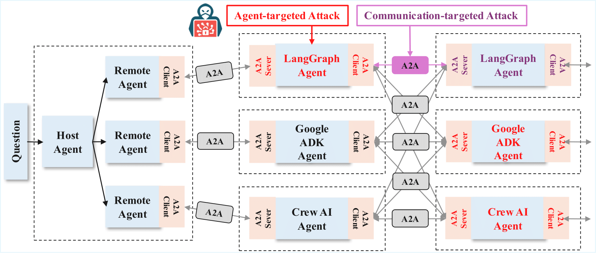
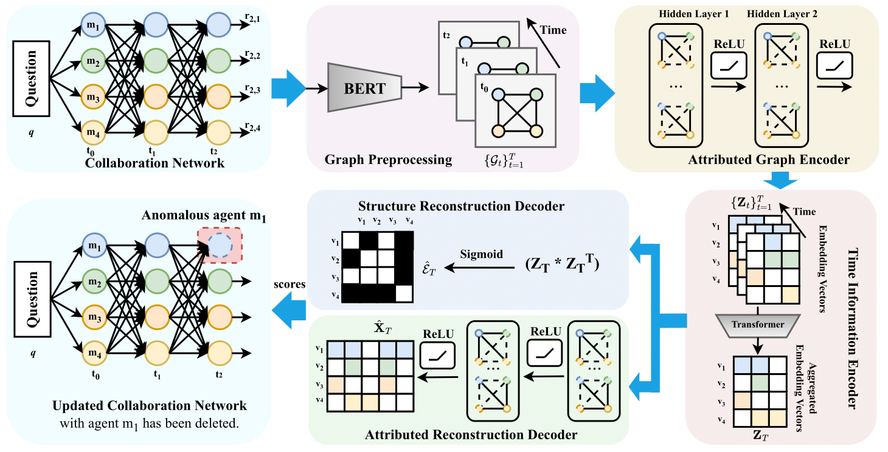

# GUARDIAN: Safeguarding LLM Multi-Agent Collaborations

Official implementation of **["GUARDIAN: Safeguarding LLM Multi-Agent Collaborations with Temporal Graph Modeling"](https://arxiv.org/abs/2505.19234)**.

## Overview

Large Language Models (LLMs) enable intelligent agents to collaborate through multi-turn dialogues, but such collaboration introduces safety challenges, including **hallucination amplification** and **error propagation**.

The figure below shows how attacks on early-stage agents or communications under the Agent-to-Agent (A2A) protocol can affect later responses, amplifying errors across agents.



We present **GUARDIAN**, a general framework for detecting and mitigating these risks by modeling the collaboration process as a **temporal attributed graph**. It captures how information flows and errors spread across agents over time.

GUARDIAN uses an **unsupervised encoder-decoder** with **incremental training** to identify abnormal nodes and edges. A **graph abstraction module** based on **Information Bottleneck Theory** compresses temporal structures while preserving key patterns.

---

## Architecture

The overall architecture of GUARDIAN is shown below.



---

## Running Experiments

We provide scripts to replicate the key experiments from our paper. Each experiment can be run with the full **GUARDIAN** model (default) or its static variant, **GUARDIAN.s**.

### 1. Hallucination Amplification

You can test the hallucination amplification scenario using the following command:

```bash
python test_acc_math_100.py > res.txt
```

By default, the code runs GUARDIAN. To switch to GUARDIAN.s, modify the run_GUARDIAN_gpt35.py file by changing the import statement:

```bash
from LLMLP_static import LLMLP
```

### 2. Agent-targeted Error Injection and Propagation

You can test the agent-targeted error injection and propagation scenario using the following command:

```bash
python test_acc_math_100_agent_attack.py > res.txt
```

By default, the code runs GUARDIAN. To switch to GUARDIAN.s, modify the run_GUARDIAN_gpt35_agent_attack.py file by changing the import statement:

```bash
from LLMLP_static_agent_attack import LLMLP
```

### 3. Communication-targeted Error Injection and Propagation

You can test the communication-targeted error injection and propagation scenario using the following command:

```bash
python test_acc_math_100.py > res.txt
```

By default, the code runs GUARDIAN. To switch to GUARDIAN.s, modify the run_GUARDIAN_gpt35.py file by changing the import statement:

```bash
from LLMLP_static_communication_attack import LLMLP
```

---

## Citation

If you find our work helpful for your research, we would greatly appreciate a citation to our paper:

```bibtex
@article{zhou2025guardian,
  title={GUARDIAN: Safeguarding LLM Multi-Agent Collaborations with Temporal Graph Modeling},
  author={Zhou, Jialong and Wang, Lichao and Yang, Xiao},
  journal={arXiv preprint arXiv:2505.19234},
  year={2025}
}
```
